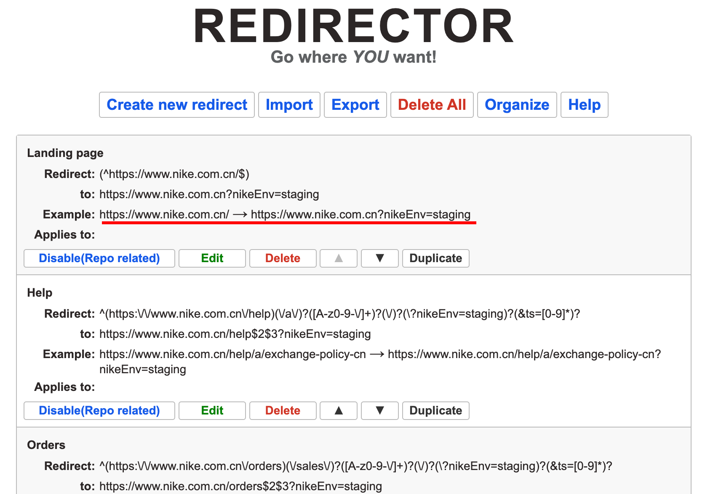

## Dotcom Redirector

Download files into your computor and unzip it

https://github.com/nike-internal/plugin-dotcomRedirector

Load file in `chrome://extensions/`

 1. set your preview branch name here
 
 2. nike env changed automaticlly and check them here
 
     you can see [default setting](<default setting.json>)
 3. Hit nike.com.cn in website and url will change